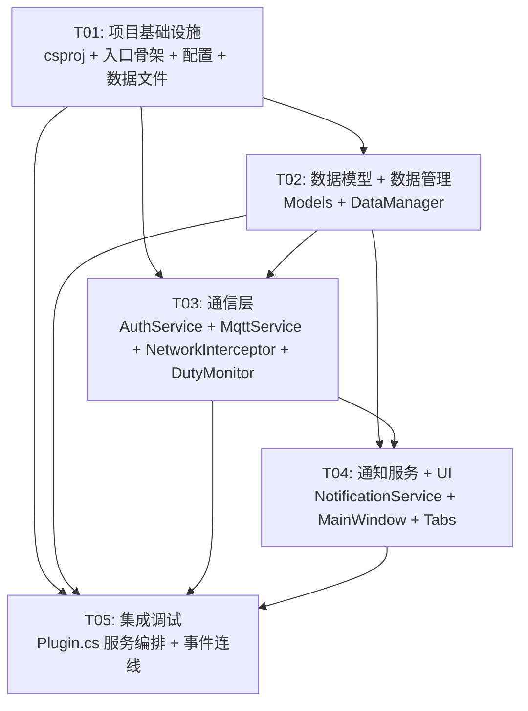

# SilverDasher — 系统架构设计文档

> 架构师：高见远 (Gao) | 版本：v1.0 | 日期：2026-06-15

---

## Part A：系统设计

### 1. 实现方案与框架选型

#### 1.1 核心技术挑战

| 挑战 | 说明 | 解决方案 |
|------|------|----------|
| Dalamud API 15 依赖注入 | API 15 使用 `[PluginService]` 静态属性注入 + 无参构造函数，与传统 DI 不同 | 照搬 CraftFlow 的 `[PluginService]` 模式，所有 Dalamud 服务通过静态属性注入 |
| MQTT WebSocket+TLS 连接 | 需要 `wss://` 协议连接 MQTT 服务器，带凭证认证 | 使用 MQTTnet 4.x 的 `MqttClientOptionsBuilder.WithWebSocketServer().WithTls().WithCredentials()` |
| 网络包 opcode 拦截 | FF14 网络协议随版本变化，opcode 需与国服客户端匹配 | 从 `opcodes.json` 加载国服 opcode，通过 Dalamud `NetworkMonitor` 拦截特定包 |
| 断线重连 | MQTT 连接可能因网络波动断开 | MQTTnet 内置 `CleanSession=false` + 自动重连策略 + 应用层 Resignal 机制 |
| 副本内暂停 | 需检测玩家是否处于副本内 | 通过 Dalamud `ClientState.IsInDuty()` 检测 |
| Toast 通知兼容性 | Windows Toast 在游戏全屏模式下可能不可见 | 使用系统 Toast API + 兜底聊天框打印；标记为待验证事项 |
| 远程数据热更新 | 需在运行时检查并下载最新静态数据 | 启动时检查 `versions.json`，按需下载替换本地数据文件 |

#### 1.2 框架与库选型

| 库 | 版本 | 用途 | 选型理由 |
|----|------|------|----------|
| Dalamud.NET.Sdk | 15.0.0 | 插件 SDK | 国服 XIVLauncherCN 强制版本 |
| MQTTnet | 4.x | MQTT 通信 | ACT 版使用 4.2.1；Dalamud 环境需验证无 DLL 冲突 |
| Newtonsoft.Json | 13.0.3 | JSON 序列化 | Dalamud 已自带，直接引用无需额外安装 |
| Dalamud.Interface | — | ImGui UI | Dalamud SDK 内置 WindowSystem + ImGui 绑定 |

#### 1.3 架构模式

采用 **分层架构 + 事件驱动** 模式：

```
┌─────────────────────────────────────────────────┐
│  UI 层 (ImGui)                                  │
│  MainWindow → HuntTab / FateTab / NotifyTab / SysTab │
├─────────────────────────────────────────────────┤
│  业务逻辑层                                      │
│  NotificationService · DataManager              │
├─────────────────────────────────────────────────┤
│  通信层                                          │
│  AuthService · MqttService · NetworkInterceptor │
├─────────────────────────────────────────────────┤
│  数据层                                          │
│  PluginConfig · Data Models · Static JSON Data  │
├─────────────────────────────────────────────────┤
│  Dalamud 框架层                                  │
│  IDalamudPlugin · [PluginService] 注入          │
└─────────────────────────────────────────────────┘
```

- **Plugin.cs** 作为入口，创建所有服务实例并协调生命周期
- **MqttService** 和 **NetworkInterceptor** 通过 C# 事件 (`event Action<T>`) 向上层传递消息
- **NotificationService** 监听 MqttService 的接收事件 + NetworkInterceptor 的本地检测事件，负责分发通知
- **DataManager** 为 NotificationService 提供名称/位置等翻译数据

---

### 2. 文件列表及相对路径

#### 2.1 项目根目录结构

```
SilverDasher/
├── SilverDasher.csproj                    # 项目配置（国服编译配置）
├── SilverDasher.json                      # Dalamud 插件 manifest
├── data/                                  # 静态数据文件
│   ├── hunt.json                          # 单体猎怪数据
│   ├── hunts.json                         # 猎怪数据（分组）
│   ├── sphunts.json                       # 特殊猎怪数据
│   ├── fates.json                         # FATE 数据
│   ├── spfates.json                       # 特殊 FATE 数据
│   ├── territories.json                   # 区域数据
│   ├── worlds.json                        # 世界/服务器数据
│   ├── patches.json                       # 版本数据
│   ├── opcodes.json                       # opcode 数据
│   └── versions.json                      # 数据版本号
├── src/
│   ├── Plugin.cs                          # 插件入口（IDalamudPlugin）
│   ├── Commands/
│   │   └── PluginCommands.cs              # /sd 命令注册
│   ├── Config/
│   │   ├── PluginConfig.cs                # 主配置（IPluginConfiguration）
│   │   ├── CWHuntConfig.cs                # 同大区猎怪订阅配置
│   │   ├── CDCHuntConfig.cs               # 跨大区猎怪订阅配置
│   │   ├── CWFateConfig.cs                # 同大区 FATE 订阅配置
│   │   └── NotificationConfig.cs          # 通知配置
│   ├── Models/
│   │   ├── AuthResult.cs                  # 认证结果模型
│   │   ├── HuntMessage.cs                 # 猎怪播报消息模型
│   │   ├── FateMessage.cs                 # FATE 播报消息模型
│   │   ├── HuntMob.cs                     # 猎怪实体模型
│   │   ├── HuntGroup.cs                   # 猎怪分组模型
│   │   ├── HuntState.cs                   # 猎怪状态模型
│   │   ├── FateInfo.cs                    # FATE 信息模型
│   │   ├── TerritoryInfo.cs               # 区域信息模型
│   │   ├── WorldInfo.cs                   # 世界/服务器模型
│   │   ├── PatchInfo.cs                   # 版本信息模型
│   │   └── OpcodeEntry.cs                # opcode 条目模型
│   ├── Services/
│   │   ├── AuthService.cs                 # 认证服务（对接 nest.silverdasher.com）
│   │   ├── MqttService.cs                 # MQTT 通信服务（MQTTnet）
│   │   ├── NetworkInterceptor.cs          # 网络包拦截服务
│   │   ├── DataManager.cs                 # 静态数据加载 + 远程更新
│   │   ├── NotificationService.cs         # Toast + 聊天框通知服务
│   │   └── DutyMonitor.cs                 # 副本状态监测服务
│   └── UI/
│       ├── MainWindow.cs                  # 主 ImGui 窗口
│       ├── Tabs/
│       │   ├── HuntTab.cs                 # 猎怪订阅 Tab
│       │   ├── FateTab.cs                 # FATE 订阅 Tab
│       │   ├── NotificationTab.cs         # 通知设置 Tab
│       │   └── SystemTab.cs               # 系统状态 Tab
│       └── OverlayWindow.cs               # 通知 Overlay 窗口（可选）
├── docs/
│   ├── PRD.md                             # 产品需求文档
│   ├── ARCHITECTURE.md                    # 本文件
│   ├── class-diagram.mermaid              # 类图
│   └── sequence-diagram.mermaid           # 时序图
└── plugin.json                            # Dalamud 插件发布描述（可选）
```

#### 2.2 csproj 配置

照搬国服编译配置，关键点：
- SDK: `Dalamud.NET.Sdk/15.0.0`
- DalamudLibPath: `%APPDATA%\XIVLauncherCN\addon\Hooks\dev\`
- 部署目标: `%APPDATA%\XIVLauncherCN\devPlugins\SilverDasher\`
- 引用 MQTTnet NuGet 包

```xml
<Project Sdk="Dalamud.NET.Sdk/15.0.0">
  <PropertyGroup>
    <DalamudLibPath>$(appdata)\XIVLauncherCN\addon\Hooks\dev\</DalamudLibPath>
    <AssemblySearchPaths>$(AssemblySearchPaths);$(DalamudLibPath)</AssemblySearchPaths>
    <Version>0.1.0.0</Version>
    <AllowUnsafeBlocks>true</AllowUnsafeBlocks>
    <ImplicitUsings>enable</ImplicitUsings>
    <IsPackable>false</IsPackable>
  </PropertyGroup>
  <ItemGroup>
    <PackageReference Include="MQTTnet" Version="4.2.1" />
    <AdditionalFiles Include="data\*.json" CopyToOutputDirectory="PreserveNewest" />
  </ItemGroup>
  <Target Name="DeployToDevPlugins" AfterTargets="Build">
    <MakeDir Directories="$(appdata)\XIVLauncherCN\devPlugins\SilverDasher\" />
    <Copy SourceFiles="$(OutputPath)SilverDasher.dll" DestinationFolder="$(appdata)\XIVLauncherCN\devPlugins\SilverDasher\" SkipUnchangedFiles="true" />
    <Copy SourceFiles="$(OutputPath)SilverDasher.json" DestinationFolder="$(appdata)\XIVLauncherCN\devPlugins\SilverDasher\" SkipUnchangedFiles="true" Condition="Exists('$(OutputPath)SilverDasher.json')" />
    <ItemGroup>
      <DataFiles Include="$(ProjectDir)data\*.json" />
    </ItemGroup>
    <Copy SourceFiles="@(DataFiles)" DestinationFolder="$(appdata)\XIVLauncherCN\devPlugins\SilverDasher\data\" SkipUnchangedFiles="true" />
  </Target>
</Project>
```

#### 2.3 SilverDasher.json (Dalamud 插件 Manifest)

```json
{
  "Author": "SilverDasher",
  "Name": "SilverDasher",
  "InternalName": "SilverDasher",
  "AssemblyVersion": "0.1.0.0",
  "Description": "FF14 跨服猎怪与 FATE 播报插件",
  "ApplicableVersion": "any",
  "DalamudApiLevel": 15,
  "LoadPriority": 0,
  "PunchoutPackage": null,
  "ImageUrls": [],
  "IconUrl": null,
  "Tags": ["hunt", "fate", "broadcast", "cross-world"]
}
```

---

### 3. 数据结构和接口（类图）

详见 `docs/class-diagram.mermaid`，核心类关系如下：

#### 3.1 类职责概述

| 类 | 职责 |
|----|------|
| `Plugin` | 插件入口，创建并协调所有服务，实现 `IDalamudPlugin` |
| `PluginConfig` | 主配置容器，实现 `IPluginConfiguration`，包含所有子配置 |
| `CWHuntConfig` | 同大区猎怪订阅开关（A/B/S/SS 各等级 + 区域筛选） |
| `CDCHuntConfig` | 跨大区猎怪订阅开关（A/B/S/SS 各等级） |
| `CWFateConfig` | 同大区 FATE 订阅开关（Common/Special） |
| `NotificationConfig` | 通知渠道开关（Toast/ChatLog/PauseInDuty） |
| `AuthService` | HTTP 认证服务，对接 `nest.silverdasher.com`，获取 MQTT 凭证 |
| `MqttService` | MQTT 通信核心，基于 MQTTnet 管理 WebSocket+TLS 连接 |
| `NetworkInterceptor` | 网络包拦截，监听 InitZone/FateInfo/ActorControlSelf |
| `DataManager` | 静态数据加载 + 远程版本检查与下载更新 |
| `NotificationService` | 通知分发，监听播报事件 → Toast/ChatLog 输出 |
| `DutyMonitor` | 副本状态监测，基于 `ClientState.IsInDuty()` |
| `MainWindow` | ImGui 主窗口，包含 4 个 Tab |
| `HuntTab` / `FateTab` / `NotificationTab` / `SystemTab` | 各功能设置页面 |

#### 3.2 数据模型概述

| 模型 | 职责 |
|------|------|
| `AuthResult` | 认证响应：token + username + MQTT 凭证 |
| `HuntMessage` | 猎怪播报消息：怪物名+位置+世界+等级+触发时间 |
| `FateMessage` | FATE 播报消息：FATE 名+位置+世界+类型+触发时间 |
| `HuntMob` | 猎怪实体：名称+等级+rank+zoneId+坐标 |
| `HuntGroup` | 猎怪分组：按 rank 聚合的猎怪集合 |
| `HuntState` | 猎怪状态：存活/死亡/等待+冷却时间 |
| `FateInfo` | FATE 信息：名称+类型+zoneId+坐标+等级 |
| `TerritoryInfo` | 区域数据：zoneId→名称映射 |
| `WorldInfo` | 世界数据：worldId→名称映射 |
| `PatchInfo` | 版本数据：patchId→版本号映射 |
| `OpcodeEntry` | opcode 条目：opcode→packetId+length 映射 |

---

### 4. 程序调用流程（时序图）

详见 `docs/sequence-diagram.mermaid`，关键流程描述如下：

#### 4.1 插件启动 + 认证 + MQTT 连接

```
Plugin() → 创建 AuthService
         → AuthService.Authenticate()
           → HTTP POST nest.silverdasher.com
           → 返回 AuthResult { token, mqttUsername, mqttPassword }
         → 创建 MqttService(authResult)
           → MqttService.Connect()
             → MQTTnet MqttClient.ConnectAsync()
             → WithWebSocketServer("tree.silverdasher.com/mqtt")
             → WithTls() + WithCredentials(username, password)
           → 连接成功
           → MqttService.SubscribeTopics()
             → 根据 PluginConfig 中的订阅设置订阅对应 MQTT topic
         → 创建 NetworkInterceptor
           → 注册 Dalamud NetworkMonitor 事件
         → 创建 DataManager
           → 加载本地 data/*.json
           → DataManager.CheckRemoteUpdates()
             → GET garlandtools.cn/silv/versions.json?t={ts}
             → 比对本地版本号
             → 下载需更新的文件
         → 创建 NotificationService
         → 创建 DutyMonitor
           → 注册 ClientState 事件
```

#### 4.2 网络包拦截 → 播报发布

```
FF14 Client → 网络包 (FateStart / HuntSpawn)
NetworkInterceptor.OnNetworkMessage()
  → 解析 opcode (从 opcodes.json 查表)
  → 判断事件类型：
    - ActorControlSelf type=2370 → FateStart
    - ActorControlSelf type=2357 → FateEnd
    - ActorControlSelf type=2364 → FateProgress
  → 构造 HuntMessage / FateMessage
  → NetworkInterceptor.HuntDetected 事件触发
    → MqttService.PublishHunt(huntMessage)
      → MQTTnet PublishAsync(topic, payload)
    → NotificationService.OnHuntBroadcast(huntMessage)
      → 检查 PluginConfig 是否订阅该等级
      → 检查 DutyMonitor.IsInDuty → 若在副本则暂停
      → 格式化消息文本
      → Toast 通知 (NotificationConfig.ToastEnabled)
      → ChatLog 打印 (NotificationConfig.ChatLogEnabled)
```

#### 4.3 MQTT 消息接收 → 通知

```
MQTT Server → 推送猎怪/FATE 消息
MqttService.OnApplicationMessageReceived()
  → 反序列化 payload → HuntMessage / FateMessage
  → MqttService.HuntReceived 事件触发 / FateReceived 事件触发
    → NotificationService.OnHuntBroadcast(huntMessage)
      → 检查订阅配置 (CWHuntConfig/CDCHuntConfig)
      → 检查副本暂停 (DutyMonitor)
      → DataManager.Lookup 翻译名称/区域
      → 输出通知
```

#### 4.4 断线重连流程

```
MqttService 连接断开
  → MQTTnet MqttClient.Disconnected 事件
  → MqttService.Reconnect()
    → 等待退避时间 (指数退避: 2s → 4s → 8s → ... → 60s)
    → AuthService.ReAuth() 获取新凭证（如 token 过期）
    → MqttClient.ConnectAsync() 重连
    → 成功 → Resignal() 重新订阅所有 topic
    → 失败 → 继续退避等待重试
```

---

### 5. 待明确事项 (UNCLEAR)

| # | 事项 | 当前假设 | 风险 |
|---|------|----------|------|
| 1 | MQTT Topic 精确格式 | 推测为 `silverdasher/hunt/{datacenter}/{world}/{rank}` 和 `silverdasher/fate/{datacenter}/{world}/{type}`，参考 ACT 版 | 需连接服务器后抓包确认，topic 结构错误会导致无法接收播报 |
| 2 | 认证 API 请求格式 | 推测为 HTTP POST `nest.silverdasher.com/auth`，body 含角色名+世界+DC，返回 JSON `{token, mqtt_user, mqtt_pass}` | 未逆向确认，认证失败则整个 MQTT 层不可用 |
| 3 | Opcodes 与国服客户端兼容性 | 使用 `opcodes.json` 中的 `cn` 字段值 (0x0096, 0x03A9, 0x01C9) | 国服每次更新可能变更 opcode，需实机验证当前版本 |
| 4 | MQTTnet 与 Dalamud DLL 冲突 | 假设 MQTTnet 4.x 不与 Dalamud 自带的库冲突，使用 NuGet 引用 | 若 Dalamud 已自带不同版本 MQTTnet，可能引发 BindingConflict |
| 5 | Toast 通知在游戏全屏下的可见性 | 假设窗口化全屏可见，独占全屏不可见 | 需实机验证，可能需要改用 Overlay 方案 |
| 6 | 静态数据文件打包方式 | 打包在插件 `data/` 目录中，随 DLL 一起部署到 devPlugins | Dalamud 标准做法，应可行 |
| 7 | HuntMessage/FateMessage 序列化格式 | 推测为 JSON 格式，字段与 ACT 版一致 | 需抓包确认 MQTT payload 的实际序列化格式 |
| 8 | 数据文件中 hunt.json 与 hunts.json 的区别 | hunt.json 可能为单体猎怪列表，hunts.json 为按区域分组 | 需查看实际数据文件内容确认 |

---

## Part B：任务分解

### 6. 依赖包列表

```
- MQTTnet@4.2.1: MQTT 协议客户端，WebSocket+TLS 连接
  （NuGet: PackageReference Include="MQTTnet" Version="4.2.1"）
- Newtonsoft.Json: JSON 序列化/反序列化
  （Dalamud 自带，通过 DalamudLibPath 引用，无需额外 NuGet）
- Dalamud.NET.Sdk/15.0.0: 插件编译 SDK
  （Project Sdk="Dalamud.NET.Sdk/15.0.0"）
```

> 注意：MQTTnet 4.2.1 需验证是否与 Dalamud 环境已有的 MQTTnet 版本冲突。
> 如冲突，可能需要降级或使用 Assembly Load Context 隔离。

---

### 7. 任务列表（按依赖关系排序）

#### T01: 项目基础设施

| 字段 | 值 |
|------|-----|
| Task ID | T01 |
| Task Name | 项目基础设施：csproj + 入口骨架 + 配置 + 命令 + 数据文件 |
| 源文件 | `SilverDasher.csproj`, `SilverDasher.json`, `src/Plugin.cs`（骨架，仅含 [PluginService] 注入 + 无参构造函数框架 + Dispose 框架）, `src/Commands/PluginCommands.cs`, `src/Config/PluginConfig.cs`, `src/Config/CWHuntConfig.cs`, `src/Config/CDCHuntConfig.cs`, `src/Config/CWFateConfig.cs`, `src/Config/NotificationConfig.cs`, `data/*.json`（10个静态数据文件） |
| 依赖 | 无 |
| 优先级 | P0 |
| 复杂度 | 低 |
| 说明 | 创建完整的项目骨架，确保能编译通过。Plugin.cs 仅包含 [PluginService] 声明 + 构造函数/Dispose 框架，服务实例在 T05 集成时填充。配置类定义完整字段但不含业务逻辑。数据文件为空占位或从 ACT 版获取。csproj 照搬国服编译配置并加入 MQTTnet NuGet 引用 + 部署 Target。 |

#### T02: 数据模型层 + 数据管理

| 字段 | 值 |
|------|-----|
| Task ID | T02 |
| Task Name | 数据模型 + 数据管理：所有 Model 类 + DataManager |
| 源文件 | `src/Models/AuthResult.cs`, `src/Models/HuntMessage.cs`, `src/Models/FateMessage.cs`, `src/Models/HuntMob.cs`, `src/Models/HuntGroup.cs`, `src/Models/HuntState.cs`, `src/Models/FateInfo.cs`, `src/Models/TerritoryInfo.cs`, `src/Models/WorldInfo.cs`, `src/Models/PatchInfo.cs`, `src/Models/OpcodeEntry.cs`, `src/Services/DataManager.cs` |
| 依赖 | T01 |
| 优先级 | P0 |
| 复杂度 | 中 |
| 说明 | 定义所有数据模型类（字段 + JSON 序列化标注）。DataManager 实现本地 JSON 加载（Newtonsoft.Json 反序列化 data/*.json）和远程版本检查更新逻辑（HTTP GET versions.json → 下载差异文件）。DataManager 提供 Lookup 方法供 NotificationService 翻译名称/区域。 |

#### T03: 认证 + MQTT 通信 + 网络拦截

| 字段 | 值 |
|------|-----|
| Task ID | T03 |
| Task Name | 通信层：AuthService + MqttService + NetworkInterceptor + DutyMonitor |
| 源文件 | `src/Services/AuthService.cs`, `src/Services/MqttService.cs`, `src/Services/NetworkInterceptor.cs`, `src/Services/DutyMonitor.cs` |
| 依赖 | T01, T02 |
| 优先级 | P0 |
| 复杂度 | 高 |
| 说明 | AuthService：HTTP 认证对接 nest.silverdasher.com，返回 AuthResult。MqttService：基于 MQTTnet 4.x 的 WebSocket+TLS+Credentials 连接，实现 Connect/Disconnect/Subscribe/Publish/Reconnect（指数退避）+ 事件（HuntReceived/FateReceived）。NetworkInterceptor：注册 Dalamud NetworkMonitor 事件，解析 opcodes.json 中的 opcode，过滤 InitZone/FateInfo/ActorControlSelf，构造 HuntMessage/FateMessage 并通过事件上报。DutyMonitor：基于 ClientState.IsInDuty() 检测副本状态变化，提供事件通知。 |

#### T04: 通知服务 + UI 层

| 字段 | 值 |
|------|-----|
| Task ID | T04 |
| Task Name | 通知服务 + UI 层：NotificationService + MainWindow + 4 Tabs |
| 源文件 | `src/Services/NotificationService.cs`, `src/UI/MainWindow.cs`, `src/UI/Tabs/HuntTab.cs`, `src/UI/Tabs/FateTab.cs`, `src/UI/Tabs/NotificationTab.cs`, `src/UI/Tabs/SystemTab.cs` |
| 依赖 | T01, T02, T03 |
| 优先级 | P0 |
| 复杂度 | 中 |
| 说明 | NotificationService：监听 MqttService.HuntReceived/FateReceived + NetworkInterceptor 的本地事件，根据 PluginConfig 的订阅设置过滤，根据 DutyMonitor.IsInDuty 决定是否暂停，使用 DataManager Lookup 翻译名称，输出 Toast 通知和 ChatLog 打印。MainWindow：ImGui WindowSystem 主窗口，Tab 式布局。HuntTab：猎怪订阅勾选界面（CWHunt/CDCHunt A/B/S/SS + 区域筛选）。FateTab：FATE 订阅勾选界面（Common/Special + 区域筛选）。NotificationTab：通知渠道开关（Toast/ChatLog/PauseInDuty）。SystemTab：MQTT 连接状态 + 认证状态 + 数据版本 + 操作按钮（检查更新/重新认证/重新连接）。 |

#### T05: 集成调试

| 字段 | 值 |
|------|-----|
| Task ID | T05 |
| Task Name | 集成 + 调试：Plugin.cs 服务编排 + 事件连线 + 端到端验证 |
| 源文件 | `src/Plugin.cs`（完善服务创建 + 事件连线 + Dispose 链） |
| 依赖 | T01, T02, T03, T04 |
| 优先级 | P0 |
| 复杂度 | 中 |
| 说明 | 完善 Plugin.cs 构造函数：创建所有服务实例（AuthService→MqttService→NetworkInterceptor→DataManager→DutyMonitor→NotificationService→MainWindow），将 MqttService 事件连接到 NotificationService，将 NetworkInterceptor 事件连接到 MqttService（发布）+ NotificationService（本地播报），将 DutyMonitor 事件连接到 NotificationService。完善 Dispose 链：所有服务按逆序释放资源。启动流程：认证→MQTT 连接→订阅→数据加载。端到端验证：确保编译通过 + 部署到 devPlugins + 在 XIVLauncherCN 中加载。 |

---

### 8. 共享知识（跨文件约定）

#### 8.1 命名规范

- **类名**：PascalCase（如 `MqttService`, `HuntMessage`）
- **方法名**：PascalCase（如 `ConnectAsync`, `PublishHunt`）
- **私有字段**：`_` 前缀 + camelCase（如 `_mqttClient`, `_authResult`）
- **事件名**：PascalCase（如 `HuntReceived`, `FateReceived`）
- **常量**：PascalCase 或 UPPER_SNAKE_CASE（如 `MqttBrokerUrl`, `MAX_RETRY_COUNT`）
- **命名空间**：`SilverDasher`（根）, `SilverDasher.Services`, `SilverDasher.Models`, `SilverDasher.Config`, `SilverDasher.UI`, `SilverDasher.Commands`

#### 8.2 日志规范

- 使用 Dalamud `IPluginLog`（通过 `[PluginService]` 注入的 `Log` 属性）
- 日志前缀统一：`[SilverDasher]`
- 级别规范：
  - `Log.Information`：关键状态变更（连接/断开/认证成功/数据更新）
  - `Log.Debug`：调试信息（包解析细节/MQTT 消息内容）
  - `Log.Error`：异常和错误（认证失败/连接失败/解析错误）
  - `Log.Warning`：可恢复问题（重连中/数据版本不一致）

#### 8.3 异常处理规范

- **网络操作**（HTTP/MQTT）：全部 try-catch，不向上抛出；失败时 Log.Error + 触发重连/重试
- **数据解析**（JSON 反序列化）：try-catch，失败时使用默认值 + Log.Warning
- **UI 操作**：ImGui 绘制中不抛异常，使用 Guard 条件跳过异常情况
- **Dispose 链**：每个服务的 Dispose 内部 try-catch，确保不阻断其他服务释放

#### 8.4 JSON 序列化约定

- 使用 `Newtonsoft.Json`（Dalamud 自带）
- 属性标注：`[JsonProperty("field_name")]`
- 配置类：`IPluginConfiguration` 接口 + `[Serializable]`
- 数据文件：反序列化为对应的 `List<T>` 或 `Dictionary<K,V>` 模型

#### 8.5 MQTT Topic 约定（待确认）

- 推测格式：
  - 猎怪：`sd/hunt/{datacenter}/{world}/{rank}`
  - FATE：`sd/fate/{datacenter}/{world}/{type}`
- payload 格式：JSON 序列化的 `HuntMessage` / `FateMessage`
- 需抓包确认实际 topic 和 payload 结构

#### 8.6 事件约定

- 服务间通信使用 C# `event Action<T>` 模式
- 事件命名：`XXXReceived`, `XXXDetected`, `XXXChanged`
- 事件触发方：`XXXReceived?.Invoke(message)`
- 事件订阅方：在 Plugin.cs 中统一连线

#### 8.7 配置持久化约定

- `PluginConfig` 通过 `IDalamudPluginInterface.SavePluginConfig()` 持久化
- 配置变更后立即调用 `Save()`
- 子配置（CWHuntConfig 等）作为 PluginConfig 的嵌套属性

---

### 9. 任务依赖图



> 说明：T02 和 T03 可并行开发（T03 的 MqttService 需要 T02 的 AuthResult/HuntMessage 模型，但可先用接口/stub）。T04 需要 T02（模型）和 T03（服务事件）完成后才能连线。T05 需要所有前置任务完成。